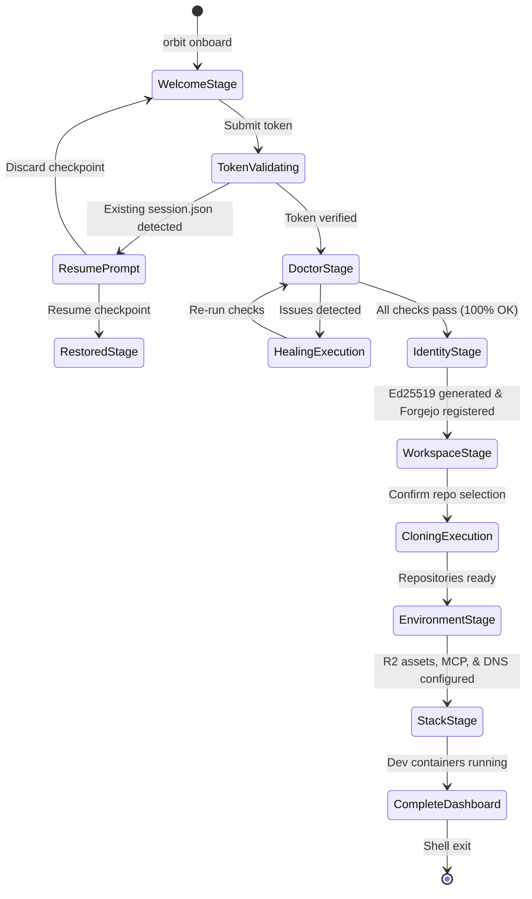

# Design Specification: Interactive TUI Onboarding Wizard (`orbit onboard`)

**Date**: 2026-08-30  
**Status**: Approved  
**Author**: Orbit Platform Team  
**Target Repository**: `orbit/orbit-cli`  

---

## 1. Executive Summary

This specification defines the architecture, user experience, state machine, and automation pipeline for the **Interactive TUI Onboarding Wizard (`orbit onboard`)**. 

The goal of this design is to deliver a zero-friction, end-to-end developer onboarding experience that transforms an incoming engineer from receiving an invitation token to having a fully functional, running development environment (repositories cloned, SSH keys enrolled, Cloudflare R2 media downloaded, DNS & TLS trusted, Cursor MCP configured, and local dev containers started) in under **3 minutes** without requiring manual out-of-band setup.

---

## 2. Architecture & State Machine

The wizard is implemented in Go under package `pkg/tui/onboard/` as a stateful Charm **Bubble Tea (`tea.Model`)** application with an explicit stage transition graph.



### 2.1 State & Session Data Model

```go
package onboard

import (
    "time"
    "github.com/manovaspace/orbit-cli/pkg/session"
    "github.com/manovaspace/orbit-cli/pkg/provisioner"
)

type WizardStage int

const (
    StageWelcome WizardStage = iota
    StageDoctor
    StageIdentity
    StageWorkspace
    StageEnvironment
    StageStack
    StageComplete
)

type WizardModel struct {
    Stage          WizardStage
    Session        *session.SessionState
    SessionManager *session.SessionManager
    Width          int
    Height         int
    
    // Sub-models for individual stages
    TokenInput     textinput.Model
    DoctorTable    table.Model
    RepoTree       list.Model
    ClonerProgress progress.Model
    AssetProgress  progress.Model
    Viewport       viewport.Model
    
    // Runtime data
    ClaimData      *provisioner.ClaimResponse
    ErrorMsg       string
    IsLoading      bool
    Spinner        spinner.Model
}
```

### 2.2 Checkpointing & Persistence (`~/.config/orbit/session.json`)

To prevent loss of work if a terminal is closed or a network timeout occurs:
1. Every stage transition commits a signed JSON checkpoint to `~/.config/orbit/session.json` (mode `0600`).
2. When launching `orbit onboard`, if a valid incomplete checkpoint exists, a **Resume Modal** is presented:
   * `[Enter]` Continue from last checkpoint (e.g. Stage 4: Workspace Cloning).
   * `[R]` Reset and discard checkpoint.
   * `[X]` Rollback (delete generated SSH keys, clean up created directories).
3. The `--resume`, `--reset` (alias `--ignore-and-remove-checkpoint`), and `--rollback` CLI flags allow programmatic control for headless/CI runs.

---

## 3. Detailed Stage-by-Stage Flow & User Experience

### Stage 1: Welcome & Token Verification
* **Layout**: Full-screen Lipgloss header with version indicator + masked token input box.
* **Token Resolution Order**:
  1. CLI flag `--token <token>`.
  2. Environment variable `ORBIT_INVITE_TOKEN`.
  3. System clipboard auto-detection if it contains a valid HMAC token pattern (`orb_inv_...`).
  4. Manual interactive input with masked text input.
* **Verification**: Sends asynchronous probe to `orbit-server` (`/v1/onboard/health` + token validation).
* **Render**: Displays a verified developer profile card:
  * Full Name & Username (`uid`)
  * Work Email (`jdoe@manova.space`)
  * Scope Cluster (`core`, `clients/manova`)
  * Token TTL & Cryptographic Integrity Check (`✔ Valid HMAC-SHA256`)

---

### Stage 2: System Pre-Flight Diagnostics & Auto-Healing
* **Check Suite**: Executes `pkg/doctor` across 5 core categories:
  1. **Host Environment**: Ubuntu 24.04/26.04 LTS (amd64, WSL2/native), `zsh` default shell, `~/.local/bin` in `$PATH`.
  2. **Toolchain Pins**: Go `1.26`, Bun `1.4.x`, Node.js `24.x LTS`, Git.
  3. **Container Runtime**: Docker daemon responsive, Docker Compose v2 active, user in `docker` group.
  4. **Network & Dev Ports**: 50-port blocks (10000–10250) scanned for conflicts per ADR-006.
  5. **Workspace Layout**: Directory permissions, manifest readability.
* **Auto-Healing**:
  * Failing items render with a yellow `[Fix Available]` tag.
  * Pressing `[F]` or selecting `[Fix All Automatically]` executes targeted healing recipes from `pkg/doctor/healer` (e.g., adding user to docker group, creating directories, setting git configurations).
* **Gate**: Requires 100% passing checks before unlocking Stage 3.

---

### Stage 3: Cryptographic Identity & Git Registration
* **Key Generation**: Generates a dedicated 256-bit Ed25519 SSH keypair at `~/.ssh/id_ed25519_orbit` (if not already present) with POSIX mode `0600`.
* **SSH Config Update**: Automatically appends a configuration stanza to `~/.ssh/config`:
  ```ssh
  Host git.dev.manova.space
      IdentityFile ~/.ssh/id_ed25519_orbit
      IdentitiesOnly yes
      StrictHostKeyChecking accept-new
  ```
* **Claim Exchange**: Submits the public key (`~/.ssh/id_ed25519_orbit.pub`) and machine fingerprint to `orbit-server` (`POST /v1/onboard/claim`).
* **Server-Side Action**: Server automatically attaches the SSH public key to the developer's Forgejo Git account.
* **Result**: Developer has instant passwordless Git push/clone access over SSH.

---

### Stage 4: Workspace Multi-Repo Cloning
* **Declarative Manifest Resolution**: Resolves target repositories from `workspace.yaml` according to the token's granted scopes.
* **Interactive Tree Customizer**:
  * Repositories matching the token scope are checked by default.
  * Optional repositories are toggleable via `[Space]`.
  * Select/Deselect All via `[A]`.
* **Concurrent Worker Pool**:
  * Clones repositories in parallel using `pkg/orchestrator` with configurable concurrency (default: 4 workers).
  * Real-time transfer statistics (spinner, percentage, transfer speed in MB/s, total bytes).
  * Safe repair fallback: If a folder exists without `.git` ("gitless"), attaches `.git` without dirtying or overwriting existing files.

---

### Stage 5: Environment, R2 Assets, Cursor MCP & Local DNS
* **Cloudflare R2 Media Assets**:
  * Uses the ephemeral read-only asset token issued in `ClaimResponse`.
  * Runs concurrent download via `orbit assets pull`, verifying SHA-256 hashes against `orbit-assets.yaml` for private PDFs, PNGs, and binary assets (ADR-022).
* **Package Registry Configurations**:
  * Go: Sets `GOPRIVATE=git.dev.manova.space/*` and `GOPROXY=https://go.dev.manova.space,https://proxy.golang.org,direct` in user shell.
  * Bun: Configures Verdaccio authentication token for `@manova/*` in `~/.bunfig.toml`.
* **Cursor / AI IDE Integration**:
  * Symlinks `handbook/cursor/rules/` and `skills/` into `.cursor/`.
  * Generates `.cursor/mcp.env` with provisioned API keys.
* **Local DNS & SSL (Single Sudo Prompt)**:
  * Prompts for a 1-time `sudo` password to:
    1. Append `127.0.0.1 *.dev.manova.space` into `/etc/hosts`.
    2. Run `caddy trust` (or `mkcert -install`) to install local root CA certificates for HTTPS without browser security warnings.

---

### Stage 6: Dev Stack Ignition & Completion Dashboard
* **Dev Stack Launch**:
  * Prompt: `Start local dev stack containers now? [Y/n]`.
  * Executes `orbit dev up` (Postgres 18, NATS JetStream, Mailpit, Redis, Authelia, Caddy).
* **Authelia 2FA Enrollment**:
  * If the account includes Authelia SSO credentials, renders a clear **ASCII QR Code** in the terminal for instant scanning with Google Authenticator / 1Password.
* **Completion Summary Dashboard**:
  * Developer Portal: `http://localhost:10007`
  * Web SSO / Identity: `http://auth.dev.manova.space:10000`
  * Mailpit Web UI: `http://mail.dev.manova.space:10000`
  * Forgejo Git: `http://git.dev.manova.space:10000`
  * Next Commands Cheatsheet (`orbit dev logs`, `orbit sync`, `orbit status`)
  * `[Enter]` exits cleanly to shell with updated environment variables loaded.

---

## 4. Error Handling & Resilience Matrix

| Error Scenario | Wizard Behavior | Recovery Action |
| :--- | :--- | :--- |
| **Invalid / Expired Token** | Highlight input in red; show error reason (`Token expired on YYYY-MM-DD`). | Allow developer to re-enter token or request a new invite. |
| **Network Timeout during Claim** | Show retry countdown (exponential backoff). | Provide `[Retry]` button and test connectivity to `orbit-server`. |
| **Git Clone Network Failure** | Mark failed repo with `✖`; pause queue without aborting other repos. | Provide `[Retry Failed Repos]` or `[Skip Repo]`. |
| **Port Conflict Detected** | Highlight conflicting process name and PID. | Provide `[Kill Process & Free Port]` (via healer recipe) or prompt manual resolution. |
| **Sudo Denied / Aborted** | Skip `/etc/hosts` and Caddy CA trust; mark as warning. | Print manual setup commands in the final dashboard so developer can run them later. |
| **Ctrl+C / SIGINT Interruption** | Capture signal, flush `session.json` checkpoint to disk, exit cleanly. | Show notice on next CLI command to resume with `orbit onboard --resume`. |

---

## 5. Implementation Architecture & File Layout

```
orbit/orbit-cli/
├── cmd/orbit/
│   └── onboard.go                 ──> Cobra CLI entrypoint, flag parsing, headless/TUI dispatch
├── pkg/
│   ├── tui/
│   │   ├── onboard/
│   │   │   ├── model.go           ──> Bubble Tea root model, Init/Update/View state loop
│   │   │   ├── stage_welcome.go   ──> Welcome banner, token input, claim preview card
│   │   │   ├── stage_doctor.go    ──> Diagnostic checklist matrix & auto-heal runner
│   │   │   ├── stage_identity.go  ──> SSH key generation, server claim exchange
│   │   │   ├── stage_workspace.go ──> Multi-select repo tree, parallel progress bars
│   │   │   ├── stage_env.go       ──> R2 asset sync, Cursor MCP, DNS/Caddy trust
│   │   │   ├── stage_stack.go     ──> Dev stack launch, Authelia 2FA QR code
│   │   │   ├── stage_complete.go  ──> Completion summary dashboard & quick links
│   │   │   └── styles.go          ──> Lipgloss palettes, borders, spinners, layout grids
│   │   └── forms/
│   │       └── invite.go          ──> Reusable interactive prompts
│   ├── doctor/                    ──> Diagnostic checks and auto-healing engine
│   ├── orchestrator/              ──> Multi-repo parallel clone and repair workers
│   ├── assets/                    ──> Cloudflare R2 asset pull and hash verification
│   └── session/                   ──> Checkpoint state persistence (~/.config/orbit/session.json)
```

---

## 6. Testing & Quality Assurance Plan

1. **Unit Tests**:
   * Test `tea.Model` state transitions for all stages (`Init`, `Update`, `View`) with simulated `tea.Msg` events.
   * Test checkpoint serialization and deserialization in `pkg/session`.
   * Test token parsing and validation edge cases.
2. **Mocked End-to-End Integration Tests**:
   * Spin up a local `httptest.Server` simulating `orbit-server` claim and health endpoints.
   * Run the wizard in non-interactive headless mode (`--token=test --non-interactive --json`) and assert that all 6 stages execute and emit structured JSON events.
3. **Interactive Terminal QA**:
   * Validate window resize responsiveness (`tea.WindowSizeMsg`).
   * Test terminal color scheme compatibility (Dark/Light mode Lipgloss palettes).
   * Verify ASCII QR code scannability on iOS/Android authenticators.
