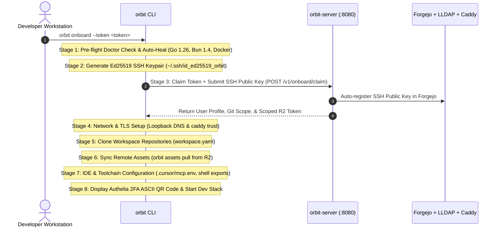

# Orbit CLI & Server: Developer-Centric Architecture & Zero-Touch Onboarding

**Document Version:** 1.0.0  
**Date:** 2026-08-30  
**Status:** Approved  
**Author:** Orbit Platform Team  

---

## 1. Executive Summary & Goals

This specification defines the unified architecture, onboarding pipeline, security hardening, and workspace orchestration for the **Orbit Developer Platform** (`orbit-cli` and `orbit-server`).

### Core Objectives
1. **Developer-Centric Focus (Strict YAGNI)**: Eliminate non-developer abstraction overhead. Every Orbit user is a developer equipped with a workstation CLI, Go and Bun toolchains, and an IDE.
2. **Zero-Touch Onboarding (`orbit onboard`)**: Transform an empty machine into a fully functional development environment with authenticated Git access, local dev routing, trusted TLS certificates, remote media assets, and running container stacks in a single command without manual follow-up.
3. **8-Digit Admin Grants & Edge Anti-Spam Hardening**: Incorporate CSPRNG 8-digit administrative grant codes, Telegram ops Secrets topic dispatching, and edge challenge suppression into platform ownership verification.
4. **Streamlined Workspace Bootstrapping**: Migrate idempotent directory and configuration setup logic from stateful migrations into `orbit init` and `orbit doctor --fix`, keeping `pkg/migrate` clean for future breaking schema transitions.
5. **Dual-Binary Architecture**: Maintain `cmd/orbit` (workstation client) and `cmd/orbit-server` (infrastructure edge daemon) in a single repository with strict package boundaries for synchronized releases and zero wire-contract drift.

---

## 2. Dual-Binary Repository Architecture

`orbit-cli` adheres to a dual-binary architecture within [`orbit/orbit-cli`](file:///home/opmc/Dev/Manova/orbit/orbit-cli):

```
orbit/orbit-cli/
├── cmd/
│   ├── orbit/                 # Workstation CLI (developer & administrator client)
│   │   ├── main.go            # Root command & post-run update notifications
│   │   ├── admin.go           # Root ownership, grant generation & TOTP management
│   │   ├── assets.go          # Cloudflare R2 media sync (ADR-022)
│   │   ├── dev.go             # Local dev stack & container orchestration
│   │   ├── doctor.go          # Pre-flight health checks & auto-healing
│   │   ├── env.go             # Environment contract validator
│   │   ├── init.go            # Declarative workspace cloner & bootstrap
│   │   ├── invite.go          # HMAC invite token generator & mailer
│   │   ├── migrate.go         # Workspace state migration engine
│   │   ├── onboard.go         # Step-by-step onboarding pipeline & TUI
│   │   ├── port.go            # 50-port block allocation inspector (ADR-006)
│   │   ├── repair.go          # Safe .git attachment to gitless trees
│   │   ├── staff.go           # Staff directory & mailbox client (ADR-024)
│   │   ├── status.go          # Multi-repo git working tree inspector
│   │   └── sync.go            # Multi-repo default branch fast-forward
│   └── orbit-server/          # Infrastructure edge daemon & onboarding gateway
│       └── main.go            # HTTP listener, mail gateway, rate limiting & anti-spam
└── pkg/
    ├── assets/                # Cloudflare R2 S3 store & orbit-assets.yaml index
    ├── client/                # HTTP API & HMAC client SDK
    ├── config/                # Workstation YAML config & secret masking
    ├── doctor/                # Diagnostics & auto-healer recipes
    ├── env/                   # .env parser, validator & schema generator
    ├── host/                  # Host constraint validator (Ubuntu 24/26 LTS, zsh, amd64)
    ├── invite/                # HMAC-SHA256 invite token signer & store
    ├── manifest/              # workspace.yaml parser & scope resolver
    ├── migrate/               # Migration runner & state tracker
    ├── onboard/               # Onboarding HTTP server, rate limiter & landing page
    ├── orchestrator/          # Git clone, sync, status & repair workers
    ├── owner/                 # Cryptographic vault, 8-digit grant manager & Telegram dispatcher
    ├── ports/                 # ADR-006 50-port allocation model
    ├── provisioner/           # Identity & Git SSH public key provisioning
    ├── session/               # Onboarding session checkpoint manager
    ├── staffhmac/             # HMAC-SHA256 request signer for orbit-staff
    └── tui/                   # Lipgloss styles, Bubble Tea forms & terminal formatting
```

---

## 3. Streamlined Developer Identity & Zero-Touch Onboarding

### 3.1 Unified Developer Creation (`orbit staff create --invite`)
Staff creation combines corporate identity provisioning (LLDAP user + Stalwart mailbox + Authelia groups) with automated developer onboarding:

```bash
orbit staff create --uid sara --name "Sara Connor" --forward sara@gmail.com --invite
```

1. **`orbit-staff` (`:10800`)**: Provisions LLDAP account, creates Stalwart mailbox, and posts credentials to Telegram ops **Secrets** topic.
2. **`orbit-server` (`:8080`)**: Issues an HMAC-SHA256 signed onboarding token with 7-day TTL and dispatches an invitation email containing the one-line onboarding command.

### 3.2 8-Stage Zero-Touch Onboarding Pipeline (`orbit onboard`)



#### Pipeline Stages Detail:
* **Stage 1 (`StageDoctorPassed`)**: Runs `orbit doctor --fix`. Verifies Ubuntu LTS (amd64), Go 1.26, Bun 1.4.x, Node >= 24, Docker Compose v2, and zsh shell. Auto-heals missing directories and system dependencies.
* **Stage 2 (`StageKeypairReady`)**: Generates an Ed25519 keypair at `~/.ssh/id_ed25519_orbit` and configures `~/.ssh/config` for `git.dev.manova.space`.
* **Stage 3 (`StageTokenClaimed`)**: Submits claim request to `orbit-server`. Server registers the SSH public key with Forgejo, binds user identity, and returns temporary access credentials.
* **Stage 4 (`StageNetworkConfigured`)**: Validates `*.dev.manova.space` resolution (updating `/etc/hosts` if loopback fails) and installs local Caddy root certificates (`caddy trust` / `mkcert -install`).
* **Stage 5 (`StageReposCloned`)**: Reads `workspace.yaml` and concurrently clones repositories matching the claimed scope.
* **Stage 6 (`StageAssetsSynced`)**: Runs `orbit assets pull` to populate gitignored media assets from Cloudflare R2 (ADR-022).
* **Stage 7 (`StageMCPConfigured`)**: Sets up `.cursor/mcp.env`, symlinks Cursor rules and skills, and exports `GOPRIVATE=git.dev.manova.space/*` and `GOPROXY` into `~/.zshrc`.
* **Stage 8 (`StageCompleted`)**: Prints an ASCII QR code for Authelia 2FA enrollment, displays the dev portal URL, and launches `orbit dev up`.

---

## 4. Admin Security Hardening: 8-Digit Grants & Anti-Spam Shield

### 4.1 8-Digit CSPRNG Grant Engine (`pkg/owner/grant.go`)
Platform ownership verification and administrative resets use 8-digit cryptographically secure pseudo-random number generated (CSPRNG) grant codes:

* **Format**: 8-digit numeric string (e.g. `58492017`).
* **Storage**: Salted SHA-256 hash stored on disk with POSIX `0600` permissions.
* **Security Constraints**:
  * **TTL**: 10 minutes maximum validity.
  * **3-Strike Attempt Burn**: After 3 invalid attempts, the grant code is permanently incinerated.
  * **Single-Use Replay Protection**: Marked as consumed immediately upon successful verification.

### 4.2 Edge Anti-Spam Shield (`orbit-server`)
* **`--disable-public-challenges`**: Blocks unauthenticated external OTP challenge requests.
* **Admin Email Allowlist (`--allowed-admins`)**: Rejects challenges requested for non-allowlisted email addresses with rate-limited delays.
* **Telegram Ops Secrets Topic Dispatcher**: Sends generated grant codes and administrative alerts directly to the secured Telegram Ops forum.

---

## 5. Workspace Bootstrapping & Migrations Refactoring

### 5.1 Idempotent Bootstrap in `orbit init` & `orbit doctor --fix`
The 4 bootstrap tasks are relocated into `orbit init` and `doctor healer recipes`:
1. `EnsureWorkspaceDirs`: Enforces top-level folder hierarchy (`orbit`, `manovaspace`, `clients`, `documents`, `share`, `temp`).
2. `InstallGitHooks`: Configures `git config core.hooksPath .githooks`.
3. `SetupMCPEnvironment`: Initializes `.cursor/mcp.env` with restricted `0600` permissions.
4. `SymlinkCursorRules`: Symlinks rules, skills, `AGENTS.md`, and `README.md` from `handbook/cursor/` into workspace roots.

### 5.2 Clean-Slate Migration Engine (`pkg/migrate`)
* Clear historical entries from `pkg/migrate/builtins.go`.
* Standardize migration state storage on `.orbit/migrations.json` (purging legacy `.manova/state.json`).
* Preserve the migration engine exclusively for future structural schema or manifest version transitions.

---

## 6. Local Dev Orchestration (`orbit dev`)

### 6.1 Multi-Service Layering
`orbit dev up` coordinates:
* `core/docker-compose.yml`: Caddy ingress, Redis, LLDAP, Authelia SSO.
* `dev/docker-compose.dev.yml`: Postgres 18, NATS JetStream, OTEL Collector, Mailpit, Grafana observability stack, Unleash feature flags.
* Dynamic Caddy proxy configuration staging (`.caddy-conf.d`).

### 6.2 Health Probing & URL Output
`orbit dev up` polls service readiness before reporting success:
* **Postgres 18**: `pg_isready -p 10332 -U orbit`
* **NATS JetStream**: HTTP health check on `:10482`
* **LLDAP**: LDAP bind check on `:10389`
* **Authelia**: HTTP health check on `https://auth.dev.manova.space`

---

## 7. Configuration & Storage Hardening (`orbit config`)

1. **Atomic File Writes**: All configuration, session checkpoints, owner vaults, and invite stores employ atomic file write patterns (`write to temp file -> fsync -> os.Rename`) with POSIX `0600` mode.
2. **Secret Masking**: `orbit config show` and CLI feedback masks sensitive values (`SMTP.Pass = "********"`).
3. **Legacy Path Purge**: All configuration and cache directories strictly use `~/.config/orbit` (removing `.config/manova` fallbacks).

---

## 8. Verified Toolchain Baseline

| Runtime / Tool | Version Pin | Source of Truth |
| :--- | :--- | :--- |
| **Go** | **`1.26`** (`1.26.0`) | `go.mod`, `versions.env`, `architecture/go-toolchain.md` |
| **Bun** | **`1.4.x`** (`bun@1.4.0`) | ADR-023; sole package manager (`bun.lock`) |
| **Node.js** | **`24.x LTS`** | ADR-023; production SSR & handbook compiler |
| **pnpm** | **Purged** | 0% workspace usage |
