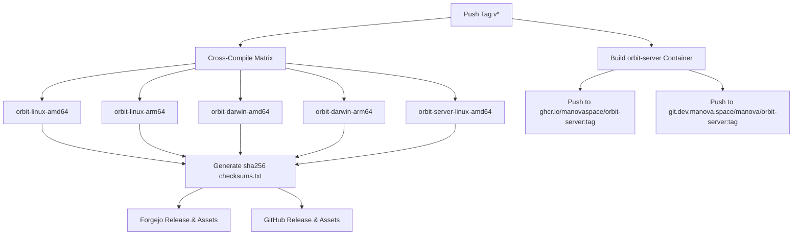

# Orbit CLI & Toolkit CI/CD & Automated Release Pipeline Design

- **Date**: 2026-08-30
- **Status**: DRAFT / UNDER REVIEW
- **Target Subsystems**:
  - `orbit/orbit-infra/.forgejo/workflows/go-ci.yml`
  - `orbit/orbit-cli/.forgejo/workflows/release.yml`
  - `orbit/orbit-cli/.forgejo/workflows/ci.yml`

---

## 1. Context & Business Sensitivity Audit

### A. Private vs. Open-Source Package Classification

| Scope | Repository / Packages | Sensitivity | Destination Registry / Host |
| :--- | :--- | :--- | :--- |
| **Open Commons** | `manovaspace/ts`, `manovaspace/design-system`, `manovaspace/docs` | **Public (MIT)** | GitHub (`github.com/manovaspace/*`), npmjs (`@manovaspace/*`) |
| **Developer Toolkit** | `orbit/orbit-cli` (CLI + `orbit-server` daemon) | **Public / Dual** | GitHub (`github.com/manovaspace/orbit-cli`), GHCR (`ghcr.io/manovaspace/orbit-server`), and Forgejo Mirror |
| **Core Microservices** | `orbit-auth`, `orbit-billing`, `orbit-notifications`, `orbit-api-gateway` | **Internal / Private** | Forgejo (`git.dev.manova.space/manova/*`), Athens Proxy, Private Registry |
| **Infrastructure & Ops** | `orbit-infra`, `orbit-staff`, `handbook` | **Internal / Private** | Forgejo, Private S3/R2, Internal Docker Compose |
| **Client Products** | `clients/*` | **Strictly Confidential** | Private Client Repositories |

### B. Findings on `orbit-cli` Codebase
- **Zero Proprietary Logic**: `orbit-cli` is purely an orchestration, doctor, and onboarding harness. It relies on standard cryptographic primitives (CSPRNG, Argon2id, AES-256-GCM, HMAC-SHA256), Cobra CLI, and Bubbletea TUI.
- **Configurable Endpoints**: All URLs (Auth, Git, Mailpit, S3/R2 assets, Dev domain) are configurable via flags, environment variables (`ORBIT_CONFIG`, `DEV_DOMAIN`, `ORBIT_INFRA_DIR`), or config files.
- **Safe for OSS**: `orbit-cli` can be released directly to GitHub with dual-mirroring to internal Forgejo.

---

## 2. Architecture & Workflows

### Workflow 1: Reusable Go CI with Automated Doc Staleness Guard (`orbit-infra/.../go-ci.yml`)

The reusable `go-ci.yml` workflow enforces code hygiene and documentation accuracy on every PR and branch push.

#### Pipeline Steps:
1. **Source Checkout**: `actions/checkout` with submodule / replace module resolution.
2. **Go Toolchain**: `actions/setup-go` with Go `1.26.x` and Go build/module caching.
3. **Secret Scanning**: Gitleaks action.
4. **Code Quality Gates**:
   - `go vet ./...`
   - `go test -race ./...`
   - `govulncheck ./...`
   - `golangci-lint` (v2.1.6)
5. **Documentation Staleness Check (New)**:
   - Compiles and runs `orbit doc -f markdown -o docs/cli` and `orbit doc -f man -o docs/cli/man`.
   - Checks `git diff --exit-code docs/cli`.
   - If a developer added/modified a CLI flag or command without running `orbit doc`, CI fails immediately with actionable instructions.

---

### Workflow 2: Multi-Platform Release & Dual Distribution (`orbit-cli/.../release.yml`)

Triggered automatically upon pushing a semantic version tag (e.g., `v0.6.0`, `v*`).

#### Key Capabilities:
1. **Cross-Compilation Matrix**:
   - Build matrices for `linux/amd64`, `linux/arm64`, `darwin/amd64` (Intel macOS), `darwin/arm64` (Apple Silicon).
   - Injects build metadata via `-ldflags="-s -w -X main.Version=${TAG} -X main.Commit=${SHA} -X main.Date=${DATE}"`.
2. **Checksum Integrity**: Generates `sha256sum * > checksums.txt`.
3. **Dual Release Creation**:
   - Publishes release notes, changelog, and binaries to **Forgejo Releases**.
   - Publishes release notes and binaries to **GitHub Releases** via `gh` CLI / GitHub API using `GITHUB_TOKEN`.
4. **OCI Container Publishing**:
   - Builds minimal Docker image for `orbit-server`.
   - Pushes dual tags (`vX.Y.Z` and `latest`) to **GitHub Container Registry (`ghcr.io/manovaspace/orbit-server`)** for OSS distribution with zero local server load.

---

## 3. Security & Operational Constraints

1. **Supply-Chain Integrity**: All GitHub and Forgejo Actions use immutable commit SHA pinning.
2. **Zero Plaintext Credentials**: `GITHUB_TOKEN` and Forgejo deploy tokens are passed strictly via workflow secrets (`secrets: inherit`).
3. **No Unbounded Artifacts**: Docker builds use multi-stage scratch/alpine runtime images to keep container size under 25MB.
4. **Backward Compatibility**: `install.sh` continues to work seamlessly against the newly structured GitHub Releases.

---

## 4. Verification Plan

1. **Local Doc Drift Emulation**: Modify a flag description, run the doc generation check step, and confirm it detects the difference.
2. **Cross-Compile Dry Run**: Verify Go compilation produces executable static binaries for all 4 matrix targets without CGO dependencies (`CGO_ENABLED=0`).
3. **Action Syntax Validation**: Verify YAML schema conformance for all workflow files.
