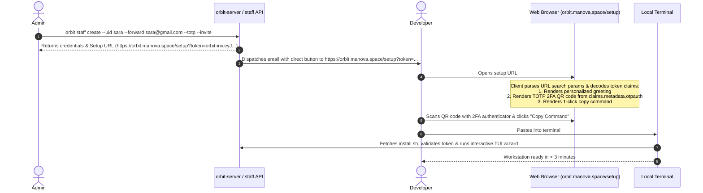

# Design Specification: Developer Web Onboarding Portal (`orbit.manova.space/setup`)

**Date**: 2026-08-31  
**Status**: Approved  
**Author**: Orbit Platform Team  
**Target Repository**: `orbit/orbit-cli`  

---

## 1. Executive Summary

This specification defines the architecture, user experience, and implementation details for the **Developer Web Onboarding Portal** hosted by `orbit-server` at `https://orbit.manova.space/setup?token=<token>` (with aliases `/onboard` and `/?token=...`).

The portal provides an intuitive, high-confidence entry point for newly onboarded developers. When opened in a browser with a valid invite token:
1. It automatically decodes signed token metadata client-side (no server-side token logging).
2. It personalizes the interface with the developer's name, email, and token expiration time.
3. If 2FA (TOTP) was provisioned, it renders an instant, high-contrast SVG **QR Code** and secret key for password manager / authenticator app scanning.
4. It provides a single **"Copy Command"** button generating the one-liner required to bootstrap their local workstation via the interactive TUI wizard:
   ```bash
   curl -fsSL orbit.manova.space | bash -s -- onboard --token <token>
   ```

---

## 2. Architecture & Data Flow



---

## 3. Component Design & Changes

### 3.1 Edge Server Routing (`pkg/onboard/server.go`)
`orbit-server` handles web requests at:
- `GET /`
- `GET /setup`
- `GET /onboard`

When an incoming request is detected as a browser (non-CLI User Agent and `Accept: text/html`):
- Serves `landing.html` directly with `Cache-Control: no-cache, no-store, must-revalidate`.
When an incoming request is from a CLI tool (`curl`, `wget`, `httpie`, etc.):
- Serves `install.sh` directly so `curl -fsSL orbit.manova.space | bash` works seamlessly.

### 3.2 Token Claims with TOTP Metadata (`pkg/invite/token.go` & `cmd/orbit/staff.go`)
When `orbit staff create --invite --totp` generates an onboarding token, the TOTP URI (`res.OTPAuth`, e.g. `otpauth://totp/Authelia:sara?secret=...&issuer=Authelia`) is included in `claims.Metadata["otpauth"]`.
Because `InviteClaims` is serialized to base64 JSON in the token payload `orbit-inv.<payloadB64>.<sigB64>`, the web browser client can inspect this without requiring an unauthenticated backend decryption endpoint.

### 3.3 Dynamic Web Landing Page (`pkg/onboard/landing.html`)
The single static `landing.html` embedded into the Go binary contains:
1. **Token Detection**:
   ```javascript
   const params = new URLSearchParams(window.location.search);
   const token = params.get('token');
   ```
2. **Payload Parsing**:
   Decodes `token.split('.')[1]` via `atob()` and `JSON.parse()`.
3. **Personalized View Mode**:
   - If `token` is present:
     - Replaces generic copy command with:
       `curl -fsSL orbit.manova.space | bash -s -- onboard --token <token>`
     - Displays recipient greeting: `"Welcome to Manova, <name>!"`
     - Displays status pill: `"✔ Valid Onboarding Token · Expires in <duration>"`
     - If `otpauth` is present:
       - Generates inline SVG QR Code using a clean, zero-dependency QR matrix generator.
       - Displays manual Secret key with a **"Copy Secret"** button.
   - If `token` is absent:
     - Retains standard public install command: `curl -fsSL orbit.manova.space | bash`.

### 3.4 CLI Output Updates (`cmd/orbit/staff.go` & `cmd/orbit/invite.go`)
When creating invites or staff with `--invite`, the CLI prints the formatted Web Setup URL:
```text
invite    inv_64a78bc19d3f
token     orbit-inv.eyJ...
web setup https://orbit.manova.space/setup?token=orbit-inv.eyJ...
```

---

## 4. Error Handling & Security

1. **Client-Side Verification & Decoding**:
   - Decoding the payload in JavaScript is purely for UI rendering; cryptographic authorization and signature validation are performed server-side by `orbit-server` when the claim request is submitted during terminal onboarding.
   - If a token is malformed, expired, or invalid JSON, the page gracefully falls back to displaying the raw token parameter with the standard copyable setup command.
2. **Zero CDN Dependencies**:
   - The SVG QR code generator is bundled directly in `landing.html` as pure JavaScript (< 100 lines), ensuring zero external network calls, zero tracking, and complete offline capability.
3. **HTTP Header Caching**:
   - `landing.html` and `install.sh` enforce `Cache-Control: no-cache, no-store, must-revalidate` and `Vary: Accept, User-Agent`.

---

## 5. Testing Plan

1. **HTTP Handler Unit Tests** (`pkg/onboard/server_test.go`):
   - Verify `GET /setup` and `GET /onboard` return `landing.html` when `Accept: text/html` is passed.
   - Verify `GET /setup` and `GET /onboard` return `install.sh` when `User-Agent: curl/8.5.0` is passed.
2. **CLI Output Tests** (`cmd/orbit/staff_test.go`, `cmd/orbit/invite_test.go`):
   - Verify `orbit staff create --invite` outputs `web setup https://...`.
   - Verify `claims.Metadata["otpauth"]` is populated when `--totp` is active.
3. **Browser Landing Page Tests**:
   - Verify parsing of tokens with and without `otpauth`.
   - Verify QR code rendering and copy button interactions.
