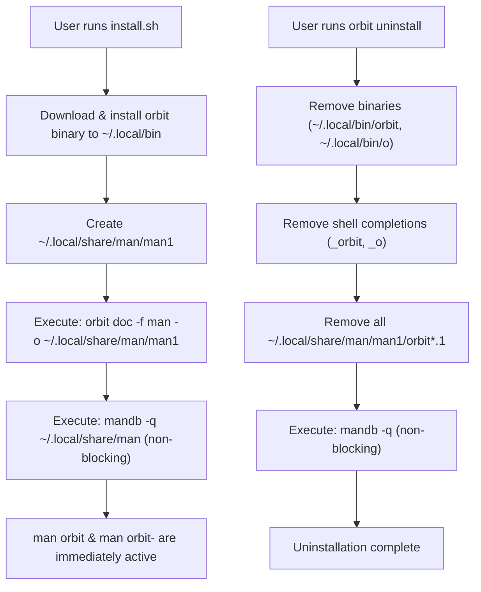

# Design Specification: Orbit CLI UNIX Man Page Installation & Lifecycle

- **Author**: Platform Architecture Team
- **Date**: 2026-09-01
- **Status**: Approved
- **Target Repository**: `orbit/orbit-cli`

---

## 1. Overview & Goals

Orbit CLI provides extensive command-line functionality with over 60 subcommands. While the binary includes a documentation generator (`orbit doc -f man`), the installation script (`install.sh`) historically placed only the executable in `~/.local/bin` without generating or registering UNIX manual pages (`man orbit`).

### Goals
1. Automatically generate and install all Orbit UNIX man pages during installation.
2. Register the manual pages with the local `mandb` database for fast `whatis` / `man -k` indexing.
3. Require zero root (`sudo`) privileges by utilizing the XDG standard user manual path (`~/.local/share/man/man1`), which is part of default `manpath` on Ubuntu/Debian.
4. Maintain clean lifecycle parity: automatically delete installed Orbit man pages and refresh `mandb` when executing `orbit uninstall`.
5. Ensure resilience: non-zero exit codes from `mandb` (e.g. in containerized or minimal environments) must never abort installation or uninstallation.

---

## 2. Architecture & Lifecycle Flow



---

## 3. Detailed Component Changes

### 3.1 Installer Scripts
**Files**:
- `orbit/orbit-cli/install.sh`
- `orbit/orbit-cli/pkg/onboard/install.sh`

**Logic Added**:
Immediately following binary symlink creation (`~/.local/bin/o`):
```bash
# 11. Install UNIX man pages into ~/.local/share/man/man1
MAN1_DIR="${HOME}/.local/share/man/man1"
mkdir -p "$MAN1_DIR"
if "${INSTALL_DIR}/orbit" doc -f man -o "$MAN1_DIR" >/dev/null 2>&1; then
  if command -v mandb >/dev/null 2>&1; then
    mandb -q "$MAN1_DIR" >/dev/null 2>&1 || mandb -q >/dev/null 2>&1 || true
  fi
fi
```

### 3.2 Uninstaller
**Files**:
- `orbit/orbit-cli/cmd/orbit/uninstall.go`
- `orbit/orbit-cli/cmd/orbit/uninstall_test.go`

**Logic Added**:
In `cmd/orbit/uninstall.go`:
```go
// Clean manual pages
manDirs := []string{
    filepath.Join(home, ".local", "share", "man", "man1"),
    "/usr/local/share/man/man1",
}
for _, md := range manDirs {
    matches, err := filepath.Glob(filepath.Join(md, "orbit*.1"))
    if err == nil {
        for _, mf := range matches {
            if err := removeFileElevated(mf); err == nil {
                fmt.Fprintf(out, "  %s  Removed man page: %s\n", iconOK, subtleStyle.Render(mf))
            }
        }
    }
}
if _, err := exec.LookPath("mandb"); err == nil {
    _ = exec.Command("mandb", "-q").Run()
}
```

---

## 4. Testing & Verification

1. **Unit Test (`uninstall_test.go`)**:
   - Create a temporary directory structure mimicking `~/.local/share/man/man1/orbit.1` and `orbit-staff.1`.
   - Run uninstall logic and assert all `orbit*.1` files are deleted while non-orbit man pages are untouched.
2. **Integration Verification**:
   - Run `install.sh` dry-run or target local install.
   - Run `man -w orbit` and `man -w orbit-staff-list` to confirm discovery.
   - Execute `mandb -q` and verify exit status.
